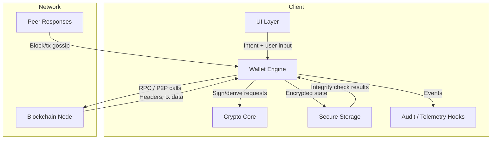

# v3 Architecture Diagrams

This file translates the v3 architecture and trust-boundary ideas into text-friendly diagrams. The wallet is assumed to run locally with minimal trust in remote infrastructure. All components shown below map directly to the full v3 paper (preserved unchanged in this folder).

## Component diagram


## Trust-boundary diagram
```mermaid
flowchart LR
    subgraph Local Trusted Boundary
        UI
        Engine
        Crypto
        Storage
    end

    subgraph External / Untrusted
        Node
        RemoteInfra[Remote Services (future opt-ins)]
    end

    UI -. user input/output .-> Engine
    Engine --> Crypto
    Engine --> Storage
    Engine -->|signed tx, queries| Node
    Node -->|responses, headers| Engine
    Engine -. optional telemetry -> RemoteInfra
    RemoteInfra -. updates / metadata .-> Engine
```

## Narrative and attack surface notes
- **Local-only components**: UI, wallet engine, crypto core, storage, and audit hooks operate within the user device. Keys, seeds, and signing inputs stay here; storage encryption and integrity checks are mandatory.
- **Network boundary**: The blockchain node (self-hosted or user-selected) and any future remote services remain outside trust. Outbound calls must specify authentication/authorization expectations and be observable via logs.
- **Key handling**: Keys are generated, derived, and used only inside the crypto core. Engine requests must carry explicit intent (user-approved action, expected chain, fee bounds) before Crypto responds.
- **Data flows**: UI never talks directly to the network or storage; Engine mediates and records integrity/telemetry results. Storage reads validate integrity before use; writes are deterministic and atomic.
- **Adversary entry points**: Malicious nodes/peers (poisoned data, fee manipulation), compromised UI flows (phishing prompts), tampered storage, or remote-update channels. Each crossing (UI→Engine, Engine→Network, Engine→RemoteInfra) should validate inputs and emit auditable events for detection.
